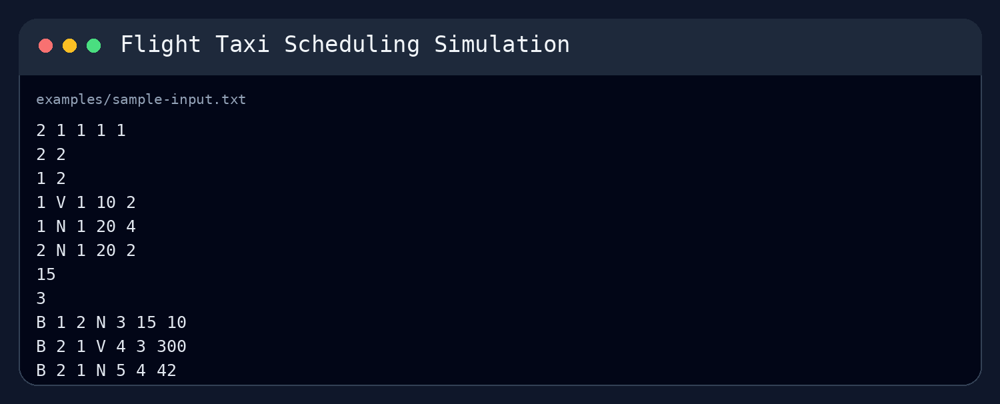
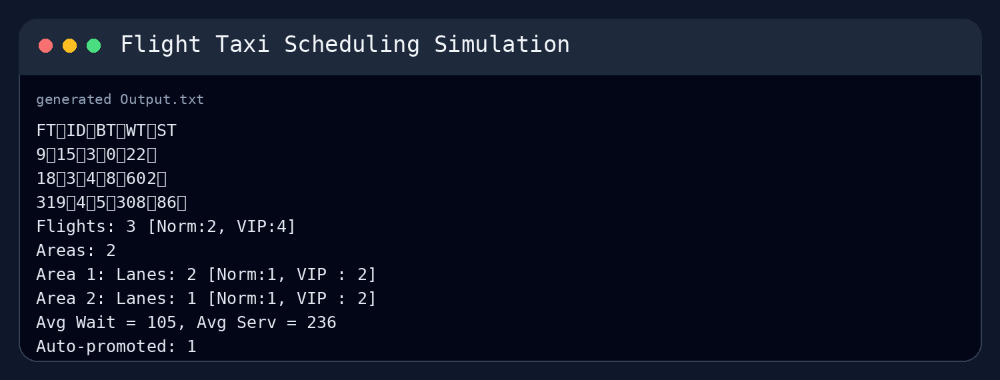

# Flight Taxi Scheduling Simulation

Flight Taxi Scheduling Simulation is a C++ based project on simulation of flight taxi scheduling system. The program reads the data of areas, lanes, flights and events from input file. The events of booking, cancellation and promotion are processed. Then the flights are scheduled according to the availability and priority of lanes. The output statistics are generated including finish time, waiting time, service time, served flights, area/lane statistics, average waiting/service time and auto-promoted flights.

## Preview

The input file defines the simulation parameters, areas, lanes, auto-promotion limit, and scheduled events.

The generated output includes flight finish time, booking time, waiting time, service time, served flight counts, area/lane statistics, average waiting/service time, and auto-promoted flights.

## Main Features

- File-based input for simulation settings, areas, lanes, and flight events
- Flight booking, cancellation, and promotion event handling
- Normal and VIP flight priority support
- Queue-based scheduling of waiting and finished flights
- Area and lane availability checking
- Takeoff and landing lane scheduling
- Auto-promotion of delayed normal flights
- Output generation with flight records and summary statistics

## Technical Overview

The project is built on object-oriented design with different classes for flights, areas, lanes, event scheduling, queues and the main scheduler. The scheduler reads the input file, builds the areas and the lanes, passes the booking/cancellation/promotions events on to the event planner, runs the simulation and writes the final output.

The event planner handles the execution of flights over time. Flights are stored in priority-aware queues and runway availability is checked before assigning takeoff and landing operations. Then completed flights are collected and written to the output file together with their completion time, waiting time, service time and related statistics.

The project uses custom data structures, e.g., linked-list style queues, to organize flights, areas, lanes, and finished records.

## How to Run

1. Open `Taxi.sln` in Visual Studio.
2. Copy one sample input file into the program working directory and name it `list.txt`.
3. Build and run the `Main` project.
4. The program will generate `Output.txt`.

## Limitations

The program expects the input in the form of text files. Therefore, input file has to be in the expected structure. The simulation is also console/file based and does not employ a graphical interface or interactive controls.
